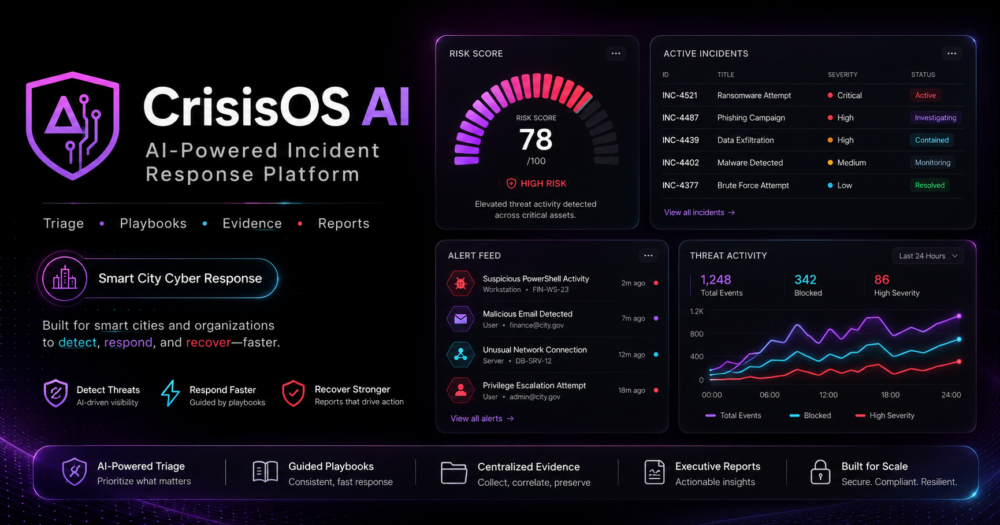
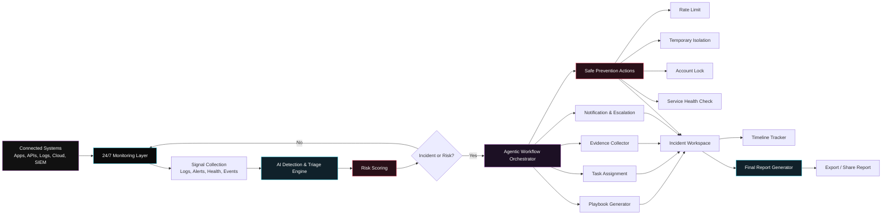
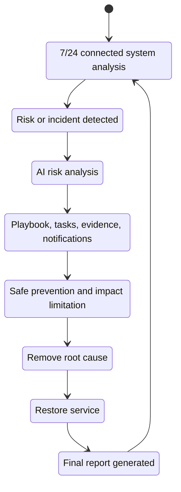
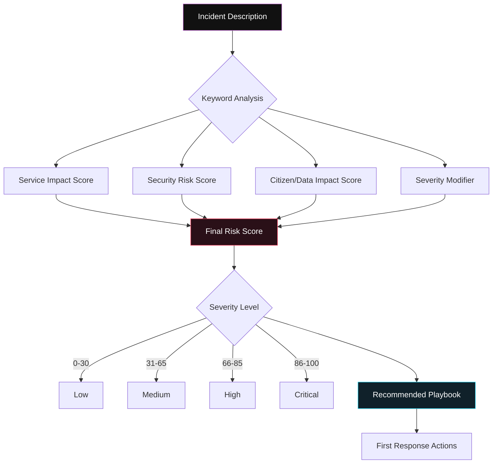
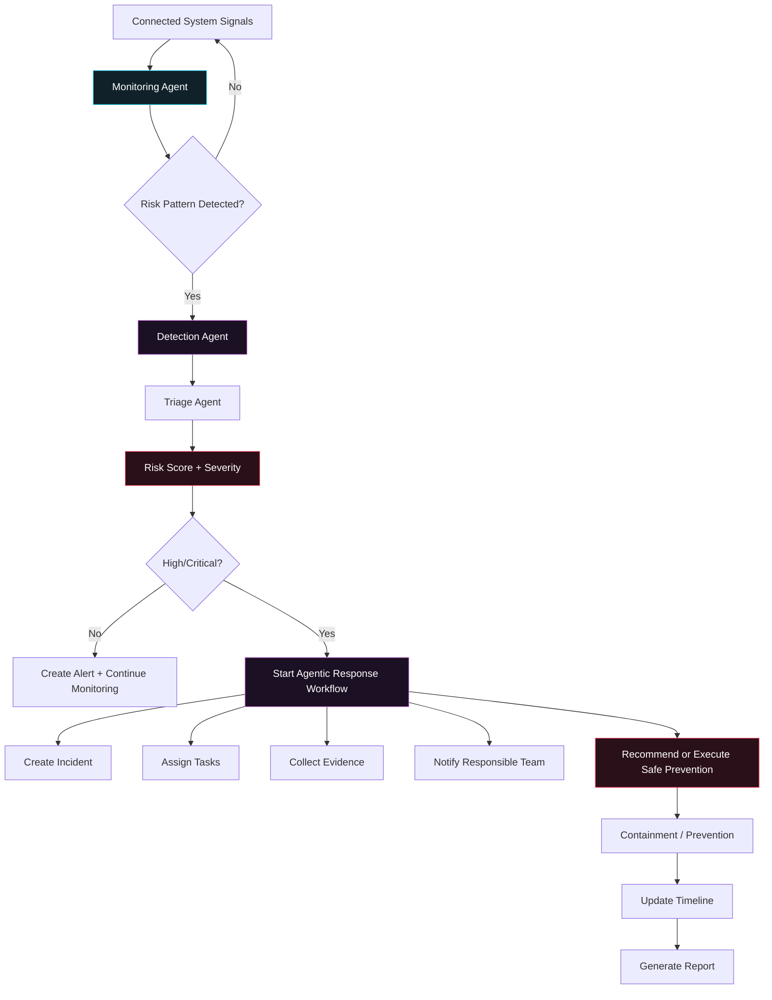
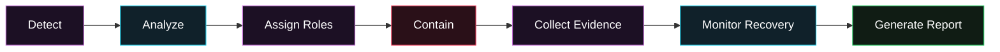
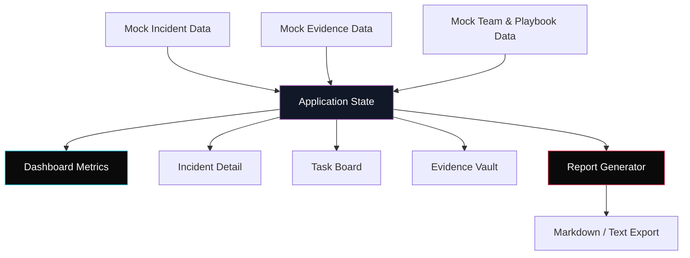
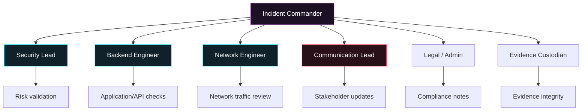

# CrisisOS AI

**AI-Powered Cyber Incident Response Platform for Smart Cities & Organizations**



CrisisOS AI kiberinsident zamanı təşkilatlarda yaranan xaosu idarə olunan, sənədləşdirilmiş və ölçülə bilən cavab prosesinə çevirən müdafiə yönümlü kibertəhlükəsizlik MVP-sidir.

Platforma qoşulduğu sistemləri **7/24 monitorinq edir**, logları, servis statuslarını, şübhəli davranışları və risk siqnallarını analiz edir. Hər hansı insident və ya risk əlaməti aşkarlandıqda AI triage məntiqi ilə risk balı hesablayır, agentic workflow başladır, cavab playbook-u yaradır, komanda rollarına tapşırıqlar təyin edir, sübutları toplayır və yekunda avtomatik insident hesabatı yaradır. Uyğun inteqrasiyalar olduqda sistem preventiv müdafiə addımlarını da icra edə bilər: servisi müvəqqəti izolə etmək, rate limit aktivləşdirmək, şübhəli girişi bloklamaq, məsul şəxslərə xəbərdarlıq göndərmək və hadisəni eskalasiya etmək.

---

## Hakaton Məlumatları

| Bölmə | Məlumat |
|---|---|
| Layihə adı | CrisisOS AI |
| Hakaton | AIRO2026 |
| Seçilmiş tapşırıq | Tapşırıq 4 — Ağıllı şəhər insident cavab idarəetmə sistemi |
| Məhsul tipi | Cyber Incident Response Management Platform |
| Yanaşma | Müdafiə yönümlü, qanuni və simulyasiya edilmiş data əsaslı |
---

## Komanda Məlumatları

> Aşağıdakı hissəni təqdimatdan əvvəl doldurun.

| Rol | Ad |
|---|---|
| Komanda adı | TEY |
| Komanda lideri | Yusif Allahverdiyev |
| Üzv 1 | Elşən Hacımuradov |
| Üzv 2 | Tələt Rzayev |

---

## Problem

Təşkilatlarda, kiçik və ya orta bizneslərdə, ağıllı şəhərlərdə kiberinsident baş verdikdə ən böyük problem təkcə texniki hücum deyil, həm də cavab prosesinin xaotik olmasıdır.

Çox vaxt komandalar bu suallara gec cavab tapırlar:

- İnsidentin prioriteti nədir?
- Hansı xidmət təsirlənib?
- Kim cavabdehdir?
- İlk 15 dəqiqədə hansı addımlar atılmalıdır?
- Hansı sübutlar qorunmalıdır?
- Yekun hesabat necə hazırlanmalıdır?

Bu gecikmə xidmət dayanması, vətəndaş məlumatlarının riskə düşməsi, reputasiya itkisi və maliyyə zərəri yarada bilər.

Əlavə problem odur ki, bir çox təşkilatda sistemlər 7/24 analiz olunmur. İnsident yalnız istifadəçi şikayəti, servis dayanması və ya artıq zərər yarandıqdan sonra görünür. CrisisOS AI bu yanaşmanı dəyişir: insidenti gözləmir, qoşulduğu sistemlərdə risk siqnallarını davamlı izləyir və erkən mərhələdə cavab workflow-u başladır.

---

## Həll

**CrisisOS AI** ağıllı şəhər və təşkilatlar üçün AI əsaslı agentic işçi kimi işləyir.

Sistem:

1. Qoşulduğu servis və sistemləri 7/24 monitorinq edir.
2. Log, status, alert, servis health və istifadəçi davranışı siqnallarını analiz edir.
3. Risk və insident əlaməti aşkarlandıqda avtomatik agentic workflow başladır.
4. Kiberinsidenti qeydiyyata alır və prioritetləşdirir.
5. İnsident təsvirini və texniki siqnalları analiz edir.
6. Risk balı və severity hesablayır.
7. Uyğun cavab playbook-u təklif edir və ya icra edir.
8. Komanda rollarına tapşırıqlar yaradır.
9. Timeline və status prosesini izləyir.
10. Evidence Vault-da sübutları saxlayır.
11. Təhlükəsiz preventiv addımlar ata bilir: alert, izolasiya, rate limit, account lock, escalation və notification.
12. Final incident report yaradır.
13. Demo/training üçün təhlükəsiz simulyasiya ssenariləri təqdim edir.

---

## Əsas Funksiyalar

### 1. Dashboard

- Açıq insidentlərin sayı
- Yüksək riskli insidentlər
- Bu gün həll olunan insidentlər
- Orta cavab müddəti
- Təsirlənmiş xidmətlər
- Risk trend chart
- Alert activity feed
- Recent incidents table
- Risk score gauge

### 2. 7/24 Monitoring & Agentic Response

Sistem qoşulduğu infrastrukturda davamlı monitorinq aparır və risk aşkarlandıqda agentic workflow başladır:

- Log və servis statuslarının davamlı analizi
- Şübhəli davranışların aşkarlanması
- Risk score və severity hesablanması
- Avtomatik incident creation
- Playbook əsaslı cavab addımları
- Human approval tələb edən kritik addımlar
- Təhlükəsiz avtomatik containment tədbirləri
- Real-time alert və escalation

### 3. AI Triage

İstifadəçi insident təsvirini daxil edir və sistem avtomatik nəticə yaradır:

- Incident type
- Severity
- Risk score
- Potential impact
- Recommended team roles
- Recommended playbook
- First 15-minute actions
- Confidence level

### 4. Attack Surface

Ağıllı şəhər xidmətləri üzrə risk görünüşü:

- Total threats
- Payment API risk
- Citizen data risk
- Service outage risk
- Security score bars
- Permissions view
- Service/workload overview

### 5. Incident Detail

Hər insident üçün vahid idarəetmə səhifəsi:

- Incident summary
- Risk score
- Status tracker
- Recommended playbook
- Assigned team
- Timeline
- Tasks
- Evidence
- Reports

### 6. Timeline & Tasks

- Hadisələrin xronoloji ardıcıllığı
- Kanban task board
- Statuslar: Open, In Progress, Monitoring, Resolved
- Komanda üzvlərinə tapşırıq təyinatı

### 7. Evidence Vault

- Log faylları
- Screenshot-lar
- Notes
- Attachments
- Hash/integrity göstəricisi
- Role-based evidence access konsepti

### 8. Reports

- Avtomatik final incident report
- Summary
- Actions taken
- Impact assessment
- Timeline
- Recommendations
- Export/copy funksiyası

### 9. Simulation Center

Təhlükəsiz demo və təlim ssenariləri:

- Smart Parking Payment Attack
- Citizen Data Leak Suspicion
- Public Camera Network Offline
- Ransomware Suspicion
- Suspicious Admin Login

---

## Sistem Arxitekturası

CrisisOS AI sadəcə insident qeydiyyatı sistemi deyil. Sistem qoşulduğu servis və infrastruktur mənbələrini davamlı izləyən, risk aşkarlayan və agentic response workflow başladan müdafiə platformasıdır.



### Agentic Response Prinsipi

CrisisOS AI insident aşkarladıqda yalnız xəbərdarlıq göstərmir. Sistem agentic workflow ilə işi mərhələlərə bölür və hər mərhələ üçün ayrıca AI agent rolunu işə salır:

| Agent | Funksiya |
|---|---|
| Monitoring Agent | Qoşulu sistemləri 7/24 izləyir, log və servis siqnallarını toplayır |
| Detection Agent | Anomaliya, failed login, service outage, data access spike və digər riskləri aşkarlayır |
| Triage Agent | Risk score, severity, təsirlənmiş servis və impact hesablayır |
| Response Agent | Uyğun playbook seçir və ilk cavab addımlarını yaradır |
| Containment Agent | Təhlükəsiz preventiv addımları təklif edir və icazəli hallarda icra edir |
| Evidence Agent | Log, screenshot, timestamp və sübut qeydlərini Evidence Vault-a əlavə edir |
| Communication Agent | Komanda üzvlərinə, adminlərə və cavabdeh şəxslərə bildiriş göndərir |
| Report Agent | Timeline, actions taken, impact və recommendations əsasında yekun hesabat yaradır |

> Kritik addımlar üçün human approval yanaşması istifadə olunur. Məsələn, production servisin izolə edilməsi, hesab bloklanması və ya genişmiqyaslı qayda dəyişikliyi administrator təsdiqi ilə icra olunur. Bu, sistemi həm təhlükəsiz, həm də real təşkilatlara uyğun edir.

---

## İnsident Cavab Dövrü



---

## AI Triage Məntiqi

MVP real AI API tələb etmədən lokal/mock triage engine istifadə edir. Məqsəd demo zamanı stabil və izah edilə bilən nəticə verməkdir.



### Risk Score Pseudo Logic

```ts
function triageIncident(text: string, service: string, severity: string) {
  let score = 20;

  if (contains(text, ["payment", "transaction", "gateway", "parking"])) score += 25;
  if (contains(text, ["failed login", "credential", "admin"])) score += 20;
  if (contains(text, ["data", "citizen records", "leak", "database"])) score += 30;
  if (contains(text, ["ransomware", "encrypted", "malware"])) score += 35;
  if (contains(text, ["offline", "camera", "heartbeat"])) score += 15;

  if (severity === "Critical") score += 20;
  if (severity === "High") score += 15;

  return Math.min(score, 100);
}
```

---

## 7/24 Agentic Monitoring Məntiqi

CrisisOS AI qoşulduğu sistemlərdən gələn siqnalları davamlı analiz edir. MVP-də bu mənbələr simulyasiya edilmiş data ilə göstərilir, real tətbiqdə isə SIEM, cloud logs, API gateway, server logs, application monitoring və identity provider inteqrasiyaları ilə işləyə bilər.



### Preventiv Müdafiə Addımları

Sistem real təşkilatda yalnız əvvəlcədən icazə verilmiş və təhlükəsiz müdafiə addımlarını icra etməlidir:

- Şübhəli trafik üçün rate limit aktivləşdirmək
- Riskli session və ya hesabı müvəqqəti bloklamaq
- Servis owner və security lead-ə təcili bildiriş göndərmək
- Problemli endpoint-i monitorinq rejiminə keçirmək
- Şübhəli activity üçün incident yaratmaq
- Log və sübutları qorumaq
- Cavab playbook-u üzrə task-lar yaratmaq

MVP-də bu addımlar simulyasiya olunur və UI üzərindən göstərilir.

---

## Playbook Workflow


---

## Data Flow



---

## İstifadəçi Rolları



---

## Texnologiya Steki

| Sahə | Texnologiya |
|---|---|
| Frontend | Next.js, React, TypeScript |
| Styling | Tailwind CSS |
| Charts | Recharts |
| Animation | Framer Motion |
| Icons | Boxicons |
| State | React state / localStorage / Zustand |
| Data | Local mock JSON/TypeScript data |
| Report | Markdown/Text generator |
| Deployment | Vercel / Netlify / Local demo |

---

## Rəng Sistemi

Layihədə istifadə olunan əsas rənglər:

| Token | Rəng |
|---|---|
| Primary | `#C871DA` |
| Secondary | `#22D3EE` |
| Tertiary / Danger | `#F43F5E` |
| Neutral Background | `#0A0A0A` |

```css
:root {
  --primary: #C871DA;
  --secondary: #22D3EE;
  --tertiary: #F43F5E;
  --neutral-bg: #0A0A0A;
}
```
---

## Quraşdırma

### 1. Repository-ni klonlayın

```bash
git clone https://github.com/Yusiko99/TEY-crisisOS-airo2026.git
cd TEY-crisisOS-airo2026
```

### 2. Dependencies quraşdırın

```bash
npm install
```

### 3. Development server başladın

```bash
npm run dev
```

### 4. Brauzerdə açın

```txt
http://localhost:3000
```

---

> MVP-də autentifikasiya real security layer kimi yox, demo giriş axını kimi istifadə olunur.

---

## Nümunə Ssenarilər

### Scenario 1 — Smart Parking Payment Attack

```txt
Smart Parking payment gateway is failing. Users cannot complete parking payments.
Multiple timeout errors and suspicious API traffic are detected.
```

Expected result:

```txt
Severity: High
Risk Score: 92/100
Recommended Playbook: Payment Service Outage Response
Recommended Roles: Security Lead, Backend Engineer, Network Engineer, Communication Lead
```

### Scenario 2 — Citizen Data Leak Suspicion

```txt
Unusual API access detected from an admin account.
Large number of citizen records were requested in a short period.
```

Expected result:

```txt
Severity: Critical
Risk Score: 96/100
Recommended Playbook: Citizen Data Leak Suspicion
Recommended Roles: Security Lead, Legal/Admin, Evidence Custodian
```

### Scenario 3 — Public Camera Network Offline

```txt
Several public camera nodes went offline at the same time.
Last heartbeat is missing from 12 camera devices.
```

Expected result:

```txt
Severity: Medium / High
Risk Score: 74/100
Recommended Playbook: Public Camera Network Offline
```

---

## Sample Data

Root `data/` qovluğunda ekspert yoxlaması üçün simulyasiya edilmiş nümunə data yerləşdirilir:

```txt
data/
├── sample-incidents.csv
├── sample-evidence.csv
└── simulated-logs.json
```

Bu data real sistemlərdən götürülməyib və yalnız demo məqsədilə yaradılıb.

---

## Təhlükəsizlik və Etik Bəyanat

CrisisOS AI yalnız müdafiə yönümlü kibertəhlükəsizlik həllidir.

Bu MVP:

- Real sistemlərə hücum etmir.
- Üçüncü tərəf şəbəkələrini skan etmir.
- Exploit və ya zərərli kod icra etmir.
- İstifadəçi və vətəndaş məlumatlarını toplamır.
- Bütün insidentləri və logları simulyasiya edilmiş data üzərində göstərir.
- Qoşulduğu sistemlər yalnız təşkilatın icazəli və sahib olduğu mühitlər kimi nəzərdə tutulur.
- Preventiv müdafiə addımları yalnız authorization və human approval prinsipi ilə işləməlidir.
- Məqsəd təşkilatların insidentlərə daha sürətli və koordinasiyalı cavab verməsinə, həmçinin bəzi risklərin zərərə çevrilmədən qarşısının alınmasına kömək etməkdir.

---

## Məhdudiyyətlər

Bu layihə hackathon MVP-sidir və aşağıdakı məhdudiyyətlərə malikdir:

- Real SIEM inteqrasiyası yoxdur.
- Real-time production monitoring MVP-də simulyasiya edilir.
- Agentic response workflow MVP-də mock data və demo action-larla işləyir.
- AI triage mock/deterministic qaydalarla işləyir.
- Evidence upload demo məqsədlidir.
- PDF export sadələşdirilmiş ola bilər.
- Multi-tenant enterprise access control tam tətbiq olunmaya bilər.

---
